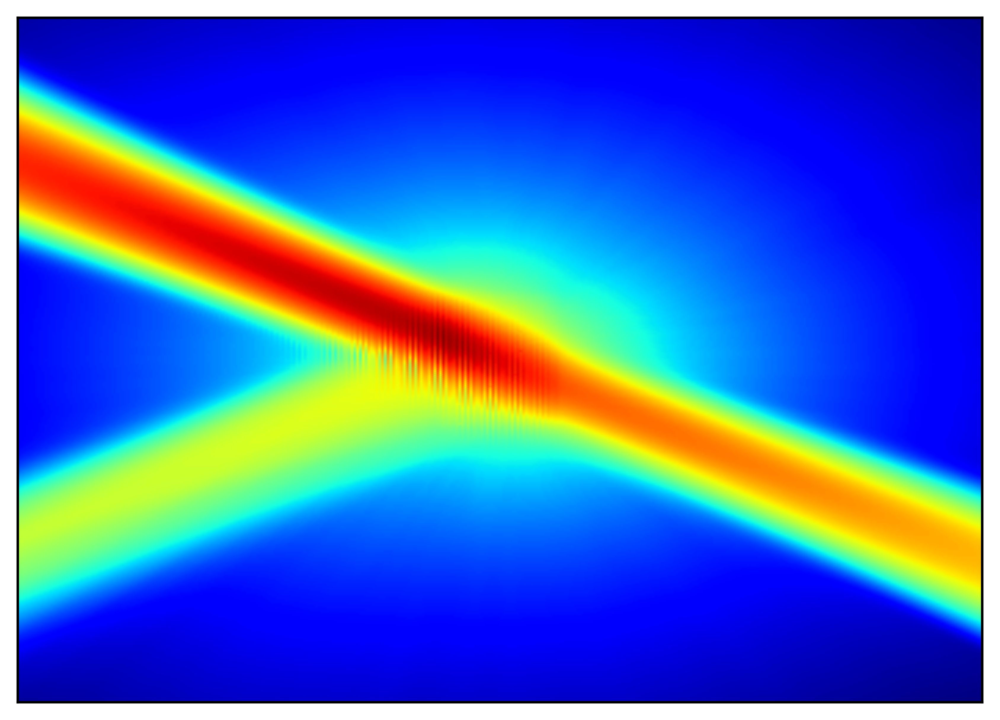

<br />
<div align="center">
    <a href="https://github.com/alexandremnd/CollectiveScattering">
        
    </a>
    <h3 align="center">Collective Scattering</h3>
    <p align="center">
        A semi-classical approach to compute scattered field in cold atom gases organized in periodic medium (or not)
    </p>
</div>

# Getting started
## Cloning and building the project

1. Clone the repository in the directory of your choice:
```bash
    git clone https://github.com/alexandremnd/CollectiveScattering.git
    cd CollectiveScattering
```

2. Set parameters in main.jl for desired periodic medium properties (density/radius/atoms count/...) and use mean function:
```bash
    julia main.jl
```


# Contributing
Contributions are currently not expected as this is an internship project.

<!-- # References -->


# License
This project is licensed under the GNU GPLv3 - see [LICENCE](LICENSE) file for details